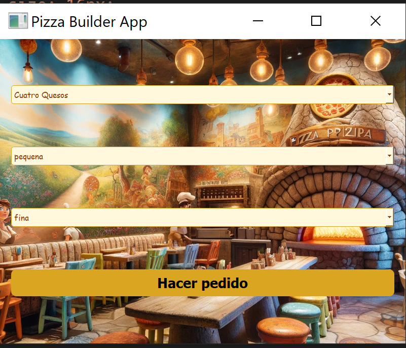

# PatronesCreacionales1

El enlace para acceder al repositorio es el siguiente: [GitHub](https://github.com/MiguelGG03/PatronesCreacionales1.git)

## `Accesos rápidos`

- [Enunciado 1](#ejercicio-1)

-  [Ejercicio 1 Resuelto](#ejercicio-1--resuelto)

    - [Cómo ejecutar](#como-ejecuto-el-programa-del-ejercicio-1)

- [Enunciado 2](#ejercicio-2)

- [Ejercicio 2 Visual](#ejercicio-2--visual)

    - [Cómo ejecutar](#como-ejecuto-el-programa-del-ejercicio-2)


# Ejercicio 1
## Análisis Modular de las Activaciones del SAMUR-Protección Civil en Madrid con Abstract Factory

### Contexto:

El SAMUR-Protección Civil es el servicio de atención a urgencias y emergencias sanitarias extrahospitalarias en el municipio de Madrid. Su labor es esencial para garantizar la seguridad y el bienestar de los ciudadanos en situaciones de emergencia. A lo largo del año, el SAMUR lleva a cabo múltiples "activaciones" en respuesta a diversas situaciones, desde accidentes de tráfico hasta emergencias médicas.

La ciudad de Madrid, en su compromiso con la transparencia y la apertura de datos, publica un registro detallado de estas activaciones en formato CSV. Este registro incluye información como la fecha, hora, tipo de emergencia, y otros detalles relevantes de cada activación.

### Objetivo:

Tu tarea es desarrollar un programa en Python que haga uso del patrón de diseño "Abstract Factory" para modularizar y estandarizar el análisis de estos datos. En específico:

1. `Lectura de Datos:` Acceda y lea el archivo CSV directamente desde el enlace proporcionado: Activaciones del SAMUR-Protección Civil. A continuación, te dejo un código que realiza la lectura del archivo CSV:
```

    import pandas as pd

 

    URL = "https://datos.madrid.es/egob/catalogo/212504-0-emergencias-activaciones.csv"

 

    #Leer CSV desde la URL

    data = pd.read_csv(URL, sep=';', encoding='ISO-8859-1')

 

    print(data.head())  # Mostrar las primeras filas para visualizar los datos


``` 
2. `Modelado de Datos:` Modela y estructura la información para su análisis.
3. `Abstract Factory:` Diseña un "Abstract Factory" que permita crear diferentes tipos de análisis o representaciones de los datos. Por ejemplo:
Una fábrica que genere análisis estadísticos (media, moda, mediana).
Una fábrica que produzca visualizaciones gráficas (histogramas, gráficos de barras).
Cada fábrica debe tener al menos dos productos concretos (e.g., histograma de activaciones por tipo de emergencia, gráfico de barras de activaciones por mes).

4. `Análisis y Representación:` Utiliza las fábricas creadas para generar distintos análisis y representaciones de los datos. Muestra la media de activaciones por día, y un histograma de las activaciones
### Recomendaciones:

- El objetivo principal es demostrar una correcta implementación y uso del patrón "Abstract Factory". Asegúrate de definir claramente las interfaces (productos abstractos) y las implementaciones concretas (productos concretos).
- Utiliza pandas para la manipulación de datos y, si decides incluir visualizaciones, considera matplotlib o seaborn.

> La puntuación máxima posible según esta rúbrica es de 30 puntos.

# Ejercicio 2
## Sistema Integral de Creación y Gestión de Pizzas Gourmet con Almacenamiento en CSV utilizando el Patrón Builder

La reconocida cadena de pizzerías gourmet "Delizioso" ha decidido lanzar una plataforma digital para permitir a sus clientes diseñar y personalizar sus pizzas al máximo detalle. Esta pizzería es conocida por su meticulosidad y su vasto menú de ingredientes, técnicas de cocción y presentaciones. Además de la personalización, "Delizioso" busca almacenar cada pizza diseñada por sus clientes en un archivo CSV para análisis posterior, recomendaciones personalizadas y marketing dirigido.

### Características a considerar:

- `Tipo de masa:` Variedades premium desde masas delgadas hasta masas fermentadas por 48 horas, con opciones de ingredientes especiales.
- `Salsa base:` Desde salsas clásicas hasta salsas de autor, incluyendo opciones veganas y de edición limitada.
- `Ingredientes principales:` Una gama que abarca desde ingredientes locales hasta importados de especialidad, todos categorizados por su origen, tipo y rareza.
- `Técnicas de cocción:` Diversidad que abarca desde hornos tradicionales hasta técnicas modernas de cocina molecular.
- `Presentación:` Opciones que van desde estilos clásicos hasta presentaciones que son verdaderas obras de arte.
- `Maridajes recomendados:` Una base de datos con cientos de opciones de vinos, cervezas y cocteles, con recomendaciones basadas en las elecciones de los ingredientes de la pizza.
- `Extras y finalizaciones:` Desde bordes especiales hasta acabados con ingredientes gourmet como trufas y caviar.
### Objetivos:

1. Diseñar un sistema que permita a los clientes construir su pizza paso a paso utilizando el patrón Builder.
2. Asegurar que cada elección sea validada para ser compatible con las selecciones previas del cliente.
3. Incorporar un sistema de recomendaciones que sugiera ingredientes, técnicas y maridajes basados en las elecciones previas del cliente.
4. Desarrollar un módulo que guarde cada pizza personalizada en un archivo CSV, almacenando cada detalle, desde los ingredientes hasta el maridaje recomendado.
5. Crear una funcionalidad que lea del archivo CSV y pueda reconstruir la pizza para su visualización, edición o reorden.
6. Garantizar la flexibilidad del sistema para futuras adiciones o modificaciones, ya que la pizzería está en constante innovación.
7. Desarrollar una interfaz de usuario amigable que guíe al cliente en el proceso de creación, ofreciendo información relevante sobre cada elección y facilitando la toma de decisiones.
8. Implementar medidas de seguridad para garantizar la integridad de los datos almacenados y la privacidad de las elecciones de los clientes.

Al final del ejercicio, el estudiante deberá justificar el uso del patrón Builder y explicar cómo se logra la robustez y adaptabilidad del sistema, destacando las ventajas de su diseño frente a otros posibles enfoques.

### Distribución de puntos:

- Implementación del patrón Builder: 15 puntos.
- Validación y compatibilidad de elecciones: 10 puntos.
- Sistema de recomendaciones: 10 puntos.
- Almacenamiento y lectura en CSV: 10 puntos.
- Flexibilidad y adaptabilidad del sistema: 5 puntos.
- Interfaz de usuario: 5 puntos.
- Seguridad y privacidad: 5 puntos.
- Justificación del diseño y uso del patrón Builder: 10 puntos.

# Ejercicio 1 : Resuelto

## Derechos legales:

Los derechos legales de uso de estos datos se puede encontrar en el siguiente [enlace](https://datos.madrid.es/egob/catalogo/aviso-legal) : https://datos.madrid.es/egob/catalogo/aviso-legal

## Condiciones a tener en cuenta:
Estas son las condiciones de uso para la reutilización de documentos y datos del 
Ayuntamiento de Madrid:

### Obligatoriedad de las condiciones generales:
Cualquier persona o empresa que reutilice datos se ve obligada a cumplir estas condiciones.

### Autorización de reutilización y cesión de derechos de propiedad intelectual:
Se permite la reutilización de documentos y datos del Ayuntamiento de Madrid para usos comerciales
y no comerciales, abarcando actividades como copia, difusión, modificación, adaptación y combinación
de la información. Se cede una autorización gratuita y no exclusiva de los derechos de propiedad
intelectual.

### Condiciones generales para la reutilización:

- Prohibición de desnaturalizar la información.
- Debe citarse la fuente y la fecha de actualización de los documentos.
- No implicar la participación o respaldo del Ayuntamiento en la reutilización.
- Conservar los metadatos y está prohibido re-identificar información anonimizada.

### Exclusión de responsabilidad:

El uso de los conjuntos de datos se realiza bajo el propio riesgo del reutilizador. 
El Ayuntamiento de Madrid no se hace responsable de daños o pérdidas causadas directa o
indirectamente por la reutilización de la información.

### Responsabilidad del reutilizador:
El reutilizador debe cumplir con la normativa vigente sobre reutilización de información 
del sector público, incluyendo el régimen sancionador establecido por la ley.

En resumen, las condiciones generales exigen respeto por la información, atribución de la fuente 
y la fecha, prohíben desnaturalizar o reidentificar datos, y establecen la responsabilidad del 
reutilizador en cumplir con la normativa correspondiente, eximiendo de responsabilidad al Ayuntamiento 
por el uso de la información reutilizada.

Los datos se hacen referencia a las Activaciones del SAMUR-Protección Civil en el año 2023.
La ruta del archivo : AnalisisModular/data/activaciones_samur_2023.csv

### Como ejecuto el programa del ejercicio 1

Para ejecutar el programa e interactuar con él desde el terminal utilizaremos el comando:

```
    python AnalisisModular/run.py
```

# Ejercicio 2 : Visual

Aquí adjunto pruebas de la correcta implementación de la interfaz gráfica de la pizzería al programa hecho con `PyQT-5`:



El programa cuenta con una interfaz gráfica y con una cliente máquina (terminal de visual).

Para ejecutar el programa, primero necesitaras instalar unos requirements en tu entorno virtual, para evitarlo he decidido crear un entorno virtual que solvente el problema y te permita ejecutar el programa desde este.

### Como ejecuto el programa del ejercicio 2

Primero necesitas activar tu entorno virtual, utiliza el siguiente comando en tu terminal:

```
    venv_pizza/Scripts/activate
```

Para ejecutar el programa en modo interfaz gráfica deberás ejecutar el siguiente comando:

```
    python CreacionYGestionDePizzas/ui.py
```

Para ejecutar el programa e interactuar con el desde el terminal utilizaremos el comando:

```
    python CreacionYGestionDePizzas/main.py
```